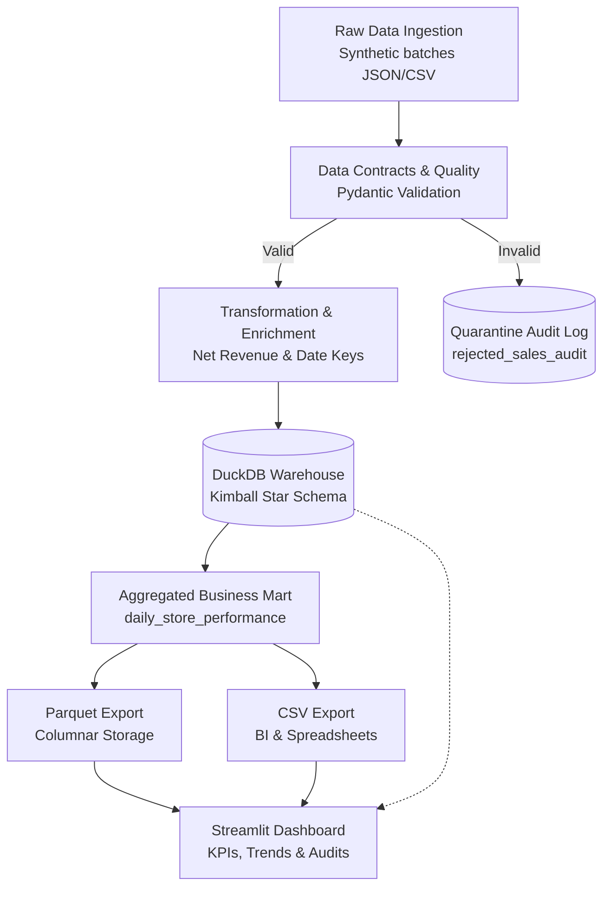

# 🛒 Smart Retail ETL Pipeline & Analytics Platform

An end-to-end, production-grade Data Engineering pipeline designed to ingest, validate, warehouse, and serve retail transaction data. Built with defensive programming principles, strict data contracts, dimensional modeling, and interactive BI reporting.

---

## 📌 Architecture Overview



## 🛠️ Tech Stack & Tooling

| Component | Technology | Purpose |
| :--- | :--- | :--- |
| **Language** | Python 3.10+ | Core ETL execution and pipeline logic |
| **Data Contracts** | Pydantic | Schema verification and defensive input validation |
| **Warehouse / OLAP** | DuckDB | Embedded columnar relational database for star-schema storage |
| **Analytical Marts** | DuckDB SQL | Dynamic mart modeling (`daily_store_performance`) |
| **Automated Testing** | Pytest | Unit validation for transformations and business metrics |
| **Export Formats** | Apache Parquet & CSV | Serving downstream BI tools (Power BI, Excel, Tableau) |
| **Visualization** | Streamlit & Plotly | Interactive web reporting dashboard with dynamic filters |
| **Version Control** | Git & GitHub | Source tracking and repository hosting |

---

## ✨ Key Features

1. **Defensive Ingestion & Dead-Letter Quarantine**:
   * Intercepts malformed records (e.g., negative prices, missing primary keys, discounts exceeding gross amounts) via strict Pydantic models.
   * Quarantined rows are written to `rejected_sales_audit` with failure diagnostics without halting batch processing.
2. **Kimball Star Schema Data Warehouse**:
   * Modeled in DuckDB with `fact_sales` surrounded by `dim_stores`, `dim_customers`, and `dim_date`.
3. **Automated Analytical Marts**:
   * Aggregates store-level daily KPIs including Gross Sales, Net Revenue, Unit Counts, and Average Basket Value (AOV).
4. **Automated BI Data Exports**:
   * Generates snappy-compressed `.parquet` files for columnar queries alongside standard `.csv` files for direct spreadsheet use.
5. **Interactive Streamlit Web Dashboard**:
   * Executive KPI summary metrics.
   * Store-by-store drill-downs and historical revenue trends.
   * Data quality breakdown visualizing rejection root causes.

---

## 📂 Project Structure

```text
smart-retail-etl-pipeline/
│
├── data/
│   ├── raw/                       # Generated raw transaction source files
│   ├── processed/
│   │   └── bi_exports/            # Automated CSV and Parquet mart exports
│   └── retail_warehouse.duckdb    # DuckDB star-schema database
│
├── src/
│   ├── config.py                  # Project paths and configuration settings
│   ├── extract.py                 # File ingestion and reading operations
│   ├── transform.py               # Pydantic schema validation and business calculations
│   └── load.py                    # DuckDB warehouse schema creation and insertions
│
├── tests/
│   └── test_pipeline.py           # Pytest unit tests for validation and calculations
│
├── analytics_summary.py           # DuckDB mart aggregation and terminal reporting
├── app.py                         # Interactive Streamlit dashboard application
├── export_bi_mart.py              # Export engine for Parquet and CSV BI artifacts
├── generate_data.py               # Synthetic transaction generator with edge cases
├── inspect_warehouse.py           # DuckDB table inspector utility
├── requirements.txt               # Project dependencies
└── README.md
```

---

## 🚀 Getting Started

### 1. Clone the Repository
```bash
git clone [https://github.com/lohi534/SMART-retail-ETL-pipeline.git](https://github.com/lohi534/SMART-retail-ETL-pipeline.git)
cd SMART-retail-ETL-pipeline
```

### 2. Set Up Virtual Environment
```powershell
python -m venv venv
.\venv\Scripts\activate
```

### 3. Install Dependencies
```powershell
pip install -r requirements.txt
pip install streamlit plotly
```

### 4. Run the Pipeline End-to-End
```powershell
# Step A: Generate synthetic sales data
python generate_data.py

# Step B: Run the ETL pipeline (Validate, Quarantine, Star-Schema Load)
python main.py

# Step C: Run unit test validation
pytest tests/

# Step D: Build data marts and export for BI
python export_bi_mart.py
```

### 5. Launch the Streamlit Dashboard
```powershell
streamlit run app.py
```
Open your browser at `http://localhost:8501` to view the live dashboard.
